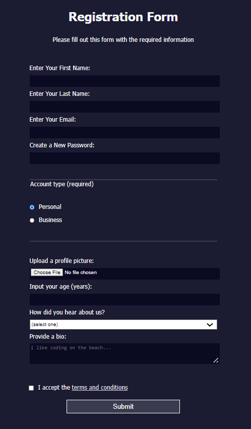

# Registration Form

A responsive registration form built using HTML and CSS as part of the FreeCodeCamp Responsive Web Design certification course.

## Description

This project showcases a registration form with various input fields, including text, email, password, file upload, and more. It serves as a learning exercise from FreeCodeCamp's curriculum.

## Features

- Responsive design that adapts to different screen sizes.
- Input fields for first name, last name, email, password, age, and more.
- Account type selection using radio buttons.
- Bio input with a textarea.
- File upload for profile pictures.
- Terms and conditions checkbox.

## Technologies Used

- HTML
- CSS

## How to Run

1. Clone the repository to your local machine.
2. Open `registrationForm.html` in your web browser.

## Acknowledgments

This project was completed as part of the FreeCodeCamp Responsive Web Design certification course. Special thanks to FreeCodeCamp for providing the resources and guidance.
